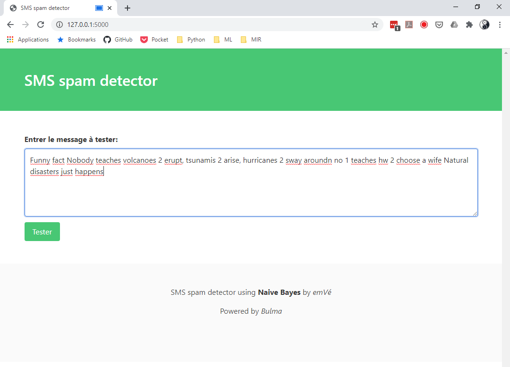
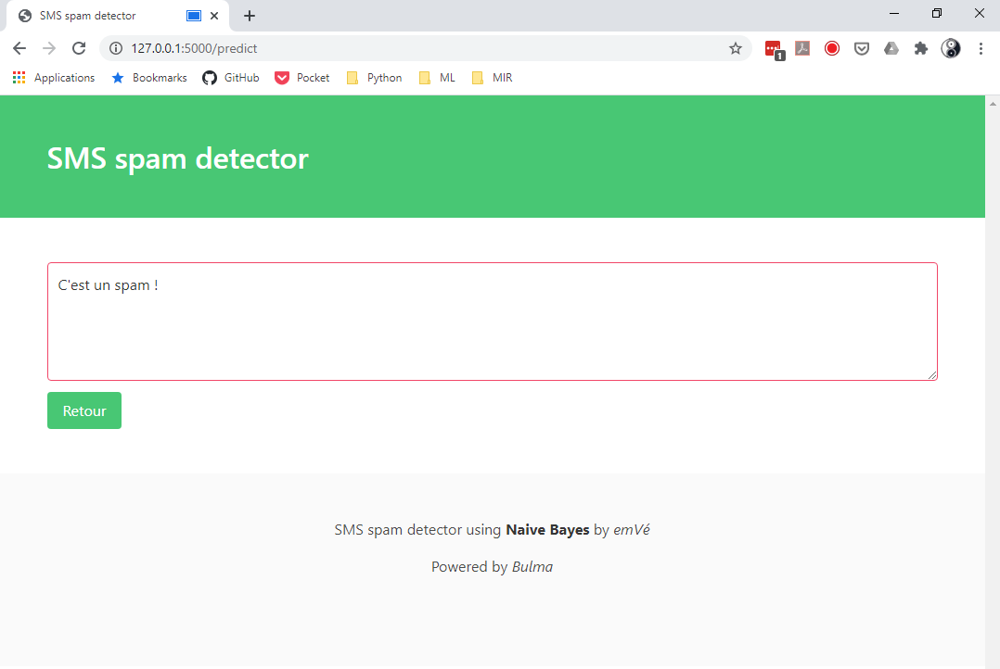

# SMS Spam Detector

## Introduction
First, using a scikit-learn [CountVectorizer](https://scikit-learn.org/stable/modules/generated/sklearn.feature_extraction.text.CountVectorizer.html) and [Multinomial Naive Bayes](https://scikit-learn.org/stable/modules/generated/sklearn.naive_bayes.MultinomialNB.html) classifier model,
I create a sms spam detector.

Then the model is deployed on a local website using Flask.

The css is powered by [Bulma](https://bulma.io/).

## requirements
```
pandas=1.1.0
sklearn=0.23.1
flask=1.1.2
```

## dataset
Link to the kaggle [dataset](https://www.kaggle.com/uciml/sms-spam-collection-dataset).

## Preprocessing and model training
_(sms spam detector.ipynb)_

The CountVectorizer is used to tokenize the words and to transform the messages
into a matrix.

Using a train test split with a test size of 33%, the Naive Bayes classifier does quite well:

## Classification report using the predictions on the test set
```
              precision    recall  f1-score   support

           0       0.99      0.99      0.99      1587
           1       0.93      0.92      0.92       252

    accuracy                           0.98      1839
   macro avg       0.96      0.95      0.96      1839
weighted avg       0.98      0.98      0.98      1839
```
## Serializing the CountVectorizer and the Model

In order to use the model in the web app, we need to export the CountVectorizer and the Model.
We create two pickles using the *joblib* library.

```python
joblib.dump(cv, wd_path.joinpath("model/cv.pkl"))
joblib.dump(clf, wd_path.joinpath("model/spam_clf.pkl"))
```

## Web app using Flask
_(app.py)_

From the main page of the web app the user is asked to enter a message.
Then he uses the "Tester" button to predict whether or not it's a spam.

## The main page:


The prediction process is done in two phases:
* the pickles are loaded:
```python
# CountVectorizer loading
cv = load(model_path.joinpath("cv.pkl"))

# classifier loading
clf = load(model_path.joinpath("spam_clf.pkl"))
```
* then the message is processed using the CountVectorizer and the prediction is done:
```python
# processing the message
message = cv.transform([request.form["message"]])

# prediction
prediction = clf.predict(message)
```
## The result page:
       
