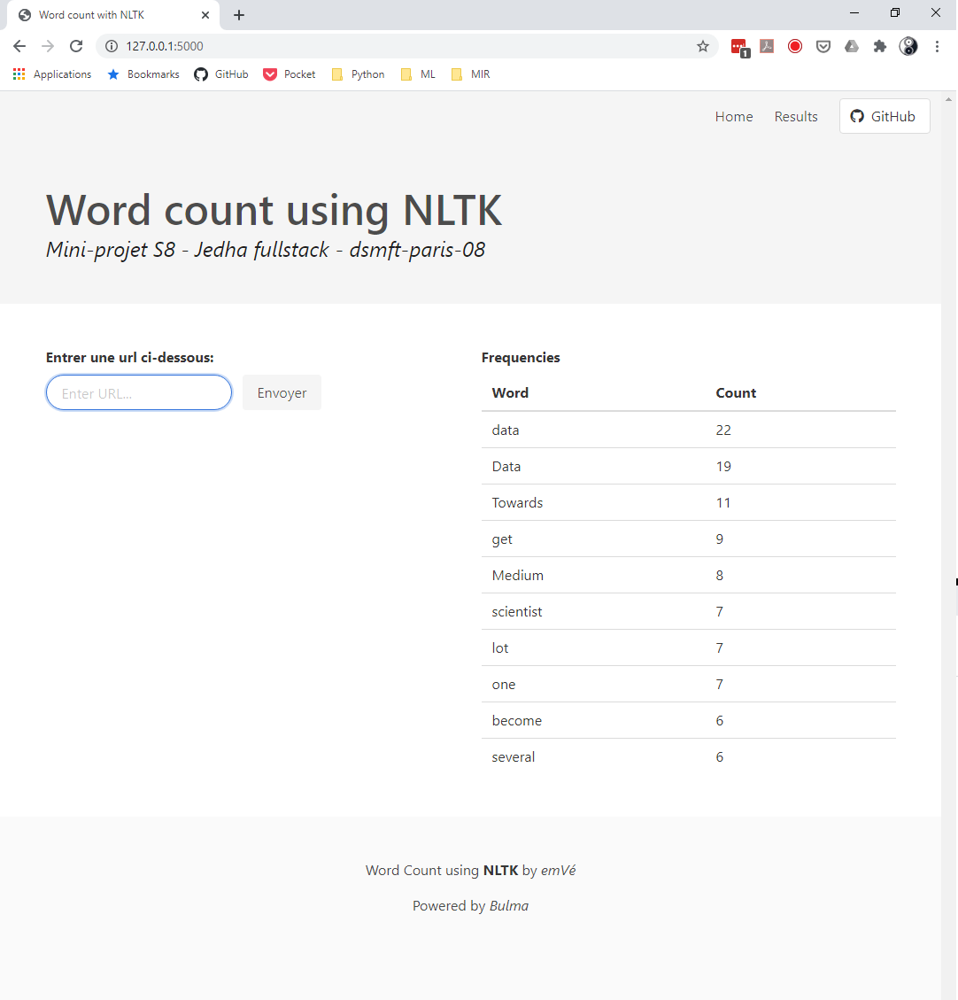
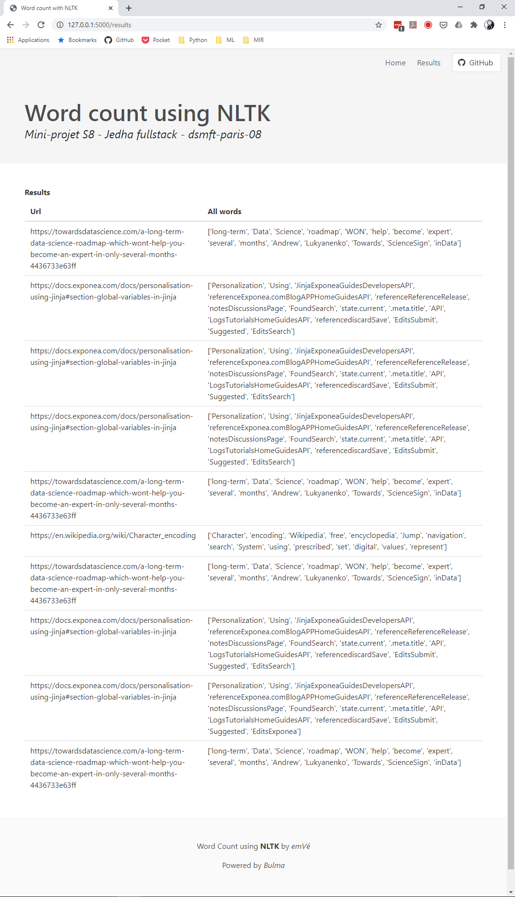

# NLP: word count using [NLTK](https://github.com/nltk/nltk)

## Introduction
This **Natural Language Processing** project uses NLTK, a python suite of modules
in order to calculate the word-frequency pairs based on the text from a given URL.

Flask is used for the website, [BeautifulSoup](https://www.crummy.com/software/BeautifulSoup/)
to get the text of the target page.

The results of the calculation are stored in a PostgreSQL database.
If you want to replicate this project you'll need at least a local instance of PostgreSQL.

The main architecture of the project is inspired by this realpython.com [tutorial](https://realpython.com/flask-by-example-part-1-project-setup/)

#### Reference
```
Bird, Steven, Edward Loper and Ewan Klein (2009).
Natural Language Processing with Python.  O'Reilly Media Inc.
```
### Requirements
The project was written in `python 3.8` and used a `PostgreSQL 12` database.
The required libraries are listed in the `requirements.txt`

#### Environment variables
You'll need to set the environment variables for this project:
```
SET APP_SETTINGS=config.DevelopmentConfig
SET SECRET_KEY=your_secret_key
SET DBHOST=localhost
SET DBUSER=postgres
SET DBPASS=your_db_pass
SET DBNAME=the_database_name
```
In unix and unix-like system the `SET` should be replaced by `export`.

## Architecture
The architecture of the website is a standard Flask one:
* the database architecture is defined in the `models.py` file.
* the database connection are defined in the `config.py` file and driven by `SQLAlchemy` and `Psycopg2`.
* the initialisation and the migrations are done using the `manage.py` file.

### app factory design patern
In the `app.py` file I used the app factory pattern, to create the flask app and initiate the db app:
```python
...
from extensions import db

# app factory
def create_app(config):
    flask_app = Flask(__name__)
    flask_app.config.from_object(config)
    flask_app.config['SQLALCHEMY_TRACK_MODIFICATIONS'] = False
    db.init_app(flask_app)

    return flask_app
```
To avoid a cyclic call between `app.py` and `models.py`, the `db` object is instanciated in the `extensions.py` file:
```python
# extensions.py
from flask_sqlalchemy import SQLAlchemy

db = SQLAlchemy()
```
## Main process
On the main page, the user is asked to enter an url, then the frequencies are calculated.
### The main page with the frequencies of a "towardsdatascience" page


## Calculation
The target page is parsed using `BeautifulSoup` then `NLTK` is used to tokenize the text:
```python
raw = BeautifulSoup(r.text, "html.parser").get_text()
nltk.data.path.append("./nltk_data/")
tokens = nltk.word_tokenize(raw)
text = nltk.Text(tokens)

# remove punctuation
non_punct = re.compile(".*[A-Za-z].*")
raw_words = [w for w in text if non_punct.match(w)]
raw_word_count = Counter(raw_words)

# stop words
no_stop_words = [w for w in raw_words if w.lower() not in stops]
no_stop_words_count = Counter(no_stop_words)
```
The url and the two lists are stored in the database.
### Tail of results in the database:



